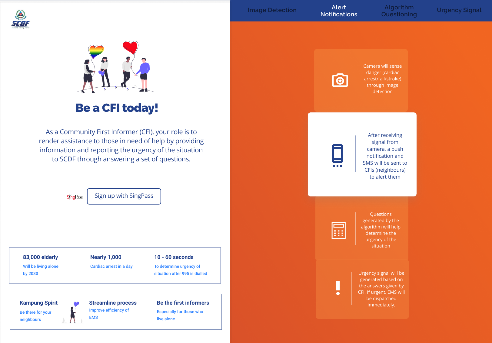
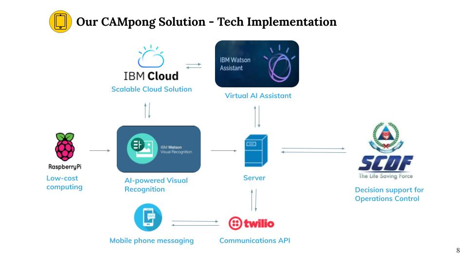
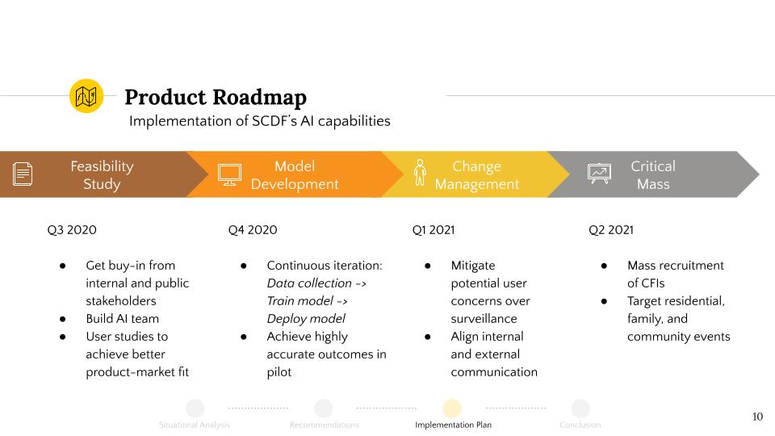

# TechLink-CAMpong_SCDFXIBM

[](https://www.apache.org/licenses/LICENSE-2.0)

## Team TechLink

- **Eugene Fang JunJie** - _Bioengineering and Technology Management, Renaissance Engineering Programme, NTU_
- **Selina Fang** - _ownself fill in_
- **Kan Zi Jun** - _Computer Science and Technology Management, Renaissance Engineering Programme, NTU_
- **Lim Jun Quan** - _Computer Science, NUS_
- **Lim Jun Hup** - _Computer Science, NUS_

## Contents

1. [Short description](#short-description)
1. [Pitch video](#pitch-video)
1. [The architecture](#the-architecture)
1. [Project roadmap](#project-roadmap)
1. [Getting started](#getting-started)
1. [Usage](#usage)
1. [Built with](#built-with)
1. [Acknowledgments](#acknowledgments)

## Short description

### What's the problem?

In the current flow of emergency relief, emergency responses and mobilisations are only activated when an individual calls 995. However, what happens if an accident or emergency happens to someone who lives alone at home? By the time any passerby realises the incident, it is often too late. Unfortunately, the rising trend of elderly staying alone will potentially make such a scenario more prevalent.

Singapore aging population is projected to consist of 20% elderly in 2025 and this number is set to grow to 33% by 2035. Out of the population, 10% of the elderly live alone and this number is too expected to rise due to declining birth rate.

Hence, the team feels that it is of utmost importance to be able to detect emergencies that happen when these elderly are alone. With early detection, we will then be able to take swift and decisive actions to reduce the fatality of such incidences.

### How can technology help?

We hope to leverage technologies such as IoT, Visual Recognition, Natural Language Processing and Automated Message Dispatch channel to tackle the problem stated.

### The idea

Our idea consists of a two-pronged approach, a technical and a social one. We hope not only to leverage on technology but also the community spirit to aid our elderly into a safer living environment.

#### Technical Solution.

We will be using IoT devices such as Raspberry Pi to keep surveillance in the house of these vulnerable elderly. By processing the live stream provided by the Raspberry Pi with our image classification model, we will determine if the elderly is currently suffering from any form of emergencies. When the probability of emergency exceeds our threshold, we will dispatch a "ask for help" message to the nearest CFI (Community First Informer).

#### Social Aspect (Kampong Spirit)

One technical worry immediately pops up and that is the accuracy of such visual classification models and the high number of false positives can potentially hinder emergency effort by SCDF due to high load.

As we understand the limitation of visual recognition to efficiently determine if any incident in fact did happen, the team came out with a social approach to mitigate this. The term CFI (Community First Informer) is inspired from CFR (Community First Responders). While the CFR role is to be the first responder to an emergency situation, CFI role will be to assist in providing information on the potential emergencies. We believe that the CFI role can empower everyday citizens like you and I to greater contribute to social and community welfare.

#### Leveraging Both Aspect

After bringing the CFI to the scene, they can interact with our chatbot to provide vital information on the situation so that we can more accurately determine the level of emergency.

Alternatively, CFI can also be the one to call for emergency based on their own judgement at the scene.

### Full pitch deck

For a more in-depth explanation on our idea, challenges we might face (privacy issues, critical mass fo effectiveness) and how we mitigate them, do refer to our full pitch deck [here](https://docs.google.com/presentation/d/10_5M_DTHn7LGWXVgC4JRWy-gb9XTHm7qAQqwSBHm2k4/edit?usp=sharing)

## Demo video

[](https://youtu.be/e3n_LYNvoTI)

_Click [here](https://youtu.be/e3n_LYNvoTI) or above to view video pitch_

## The architecture



## Project roadmap



In our 4 stage implementation plan, change management (getting buy-in from the public) is the toughest step, followed by the recruitment of CFIs for an effective solution.

The first stages for any AI project is to

1. Start with a small AI team and initiative
2. Prove the organizational value of AI through prototype development and achieving successful results from the pilot testing

For our CAMpong solution, privacy concerns due to the cameras being at home will be an issue. Our team takes data protection and privacy concerns seriously and we want our stakeholders to feel the same way too.

The mitigation strategy focuses heavily on addressing this risk to safeguard the public's interest, and yet still manages to serve their needs for emergency response.

The last step involves gaining a critical mass of CFIs that we can rely on. At this stage, residential and community events will be ideal for outreach and user education. Live demonstrations can be performed here.

For further development of the project, we hope to integrate this technology into other types of emergency response situations, and other plausible SCDF operational processes as well.

## Getting started

These instructions will get you a copy of the project up and running on your local machine for development and testing purposes.

### Prerequisites

Before you can begin, you'll need to sign up for a trial account with Twilio to get the needed credentials as well the the trial number to start sending out messages.

Do contact us for the Watson Assistant keys for access to our model.

### Running on local machine

1. Clone the repo to any folder in your local machine

   ```bash
   git clone https://github.com/kanzijun/TechLink-SolutionName_SCDFXIBM.git
   ```

2. a. To start the frontend

   ```bash
   cd frontend/
   yarn install
   yarn start
   ```

   b. To start the backend

   ```bash
   cd backend/
   ```

   Create a credentials.js file with the following keys

   ```javascript
   module.exports = {
     TWILIO_CREDS: {
       accountSid: ,
       authToken: ,
       trialNumber: ,
       toNumber: ,
     },
     WATSON_ASSISTANT: {
       version: "2020-04-01",
       apiKey: ,
       url: ,
       assistantId: ,
     },
   };
   ```

   Insert your own credentials from the steps in pre-requisite

   Next, In package.json, replace the phone number in twilio-hook script with the trial number from your own Twilio account

   Follow the instructions in [twilio-cli-steps](https://www.twilio.com/docs/sms/quickstart/node#install-the-twilio-cli) to authenticate with your twilio account.

   Afterwards,

   ```bash
   yarn install
   yarn start
   ```

The frontend will be deployed on http://localhost:3000, backend on http://localhost:8080

## Usage

We used the frontend service to simulate a frame from the video stream being processed. The model will determine if the frame has an individual suffering from cardiac arrest and send a notification to the number that you indicated in the credential (of course in the real implementation, it will send to the nearest CFI). The CFI will then be able to converse with the chatbot through the sms service and provide information for our system to make an action (call scdf or false alarm).

## Built with

- [IBM Watson Visual Recognition](https://www.ibm.com/sg-en/cloud/watson-visual-recognition) - The service on the IBM Cloud that enables you to tag, classify and search visual content using machine learning.
- [IBM Watson Assistant](https://www.ibm.com/cloud/watson-assistant/) - The conversation AI platform for chatbot
- [IBM Cloud Foundry](https://www.cloudfoundry.org/) - Deployment of backend service

## Acknowledgments

- SCDF
- IBM
